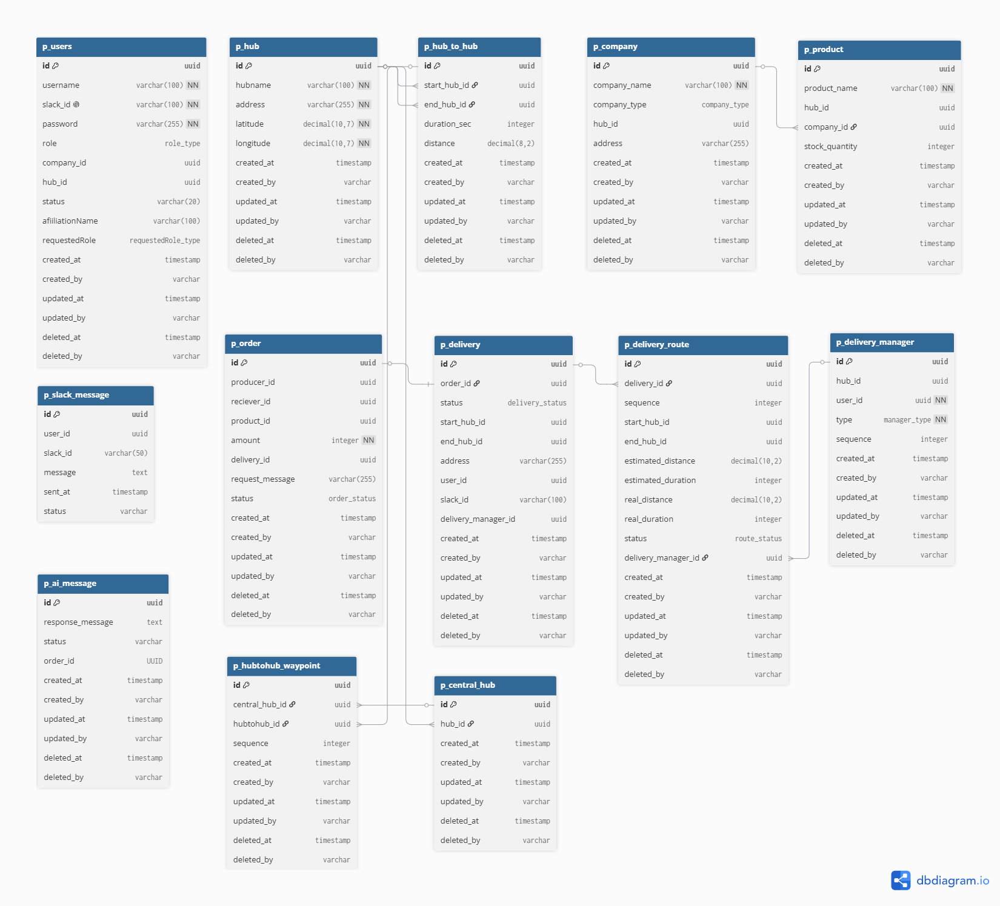

# ERD

각 마이크로서비스는 독립된 데이터베이스를 사용합니다 (Database per Service 패턴).

## 데이터베이스 구성

| 서비스 | 데이터베이스 |
|--------|------------|
| user-service | `user_db` |
| hub-service | `hub_db` |
| company-product-service | `company_product_db` |
| order-service | `order_db` |
| delivery-service | `delivery_db` |
| slack-ai-service | `slack_ai_db` |
| keycloak | `keycloak_db` |

## ERD 다이어그램

