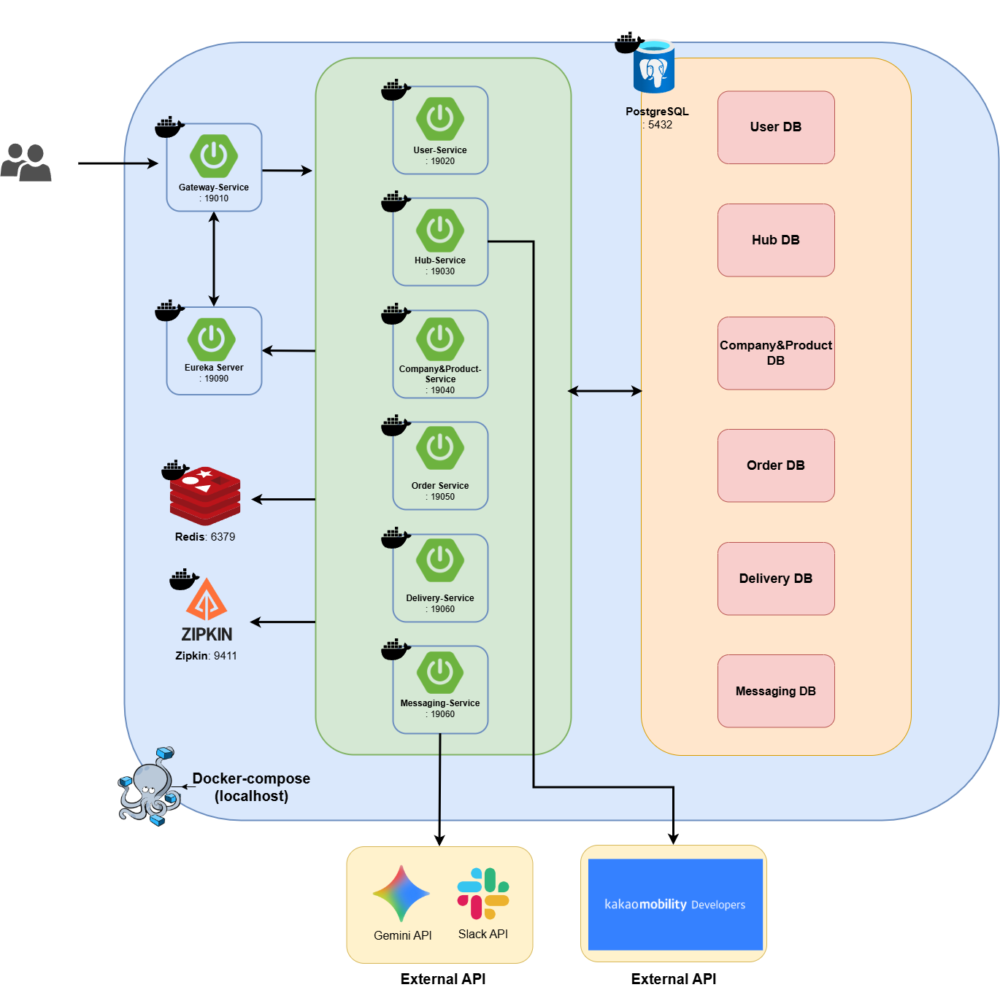

# 프로젝트 소개

## 배경 및 목적

**hub-delivery-system**은 허브 기반 물류 네트워크를 통해 주문부터 배송까지의 전 과정을 관리하는 시스템입니다.

여러 거점 허브를 경유하는 배송 경로를 자동으로 구성하고, 업체·상품·재고·배송 담당자 등 물류에 필요한 도메인을 통합 관리합니다.
서비스 간 데이터 연동과 API 신뢰성이 핵심 과제인 만큼, Spring Cloud 기반 MSA로 설계하여 각 도메인을 독립적으로 운영하면서도 유기적으로 연결되도록 구성했습니다.

AI(Gemini API)와 Slack을 연동해 배송 경로 최적화 및 실시간 알림 기능을 제공하며,
Kafka Outbox 패턴을 도입해 서비스 간 비동기 통신의 데이터 무결성을 보장합니다.

## 주요 기능

- 사용자 관리 및 Keycloak 기반 인증/인가
- 허브 등록, 허브 간 이동 정보 관리
- 업체 및 상품 관리
- 주문 생성 및 취소 (재고 자동 연동)
- 배송 생성, 경로 배정, 상태 관리
- Kafka 기반 서비스 간 비동기 이벤트 처리 (Outbox 패턴)
- Slack AI 서비스를 통한 배송 지연 알림 및 경로 최적화 제안

## 시스템 아키텍처

## 서비스 간 통신

| 방식 | 사용처 |
|------|--------|
| REST (OpenFeign) | 동기 서비스 간 호출 (재고 조회, 허브 정보 조회 등) |
| Kafka (Outbox 패턴) | 비동기 이벤트 (주문 생성/취소 → 배송 생성/삭제) |
| Keycloak | 인증 토큰 발급, JWT 검증 |
